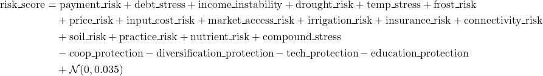
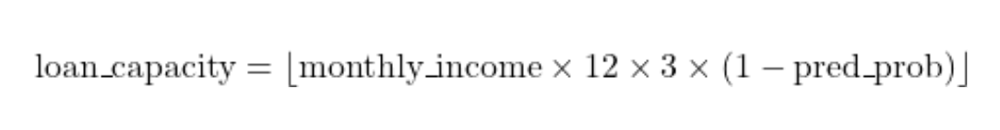
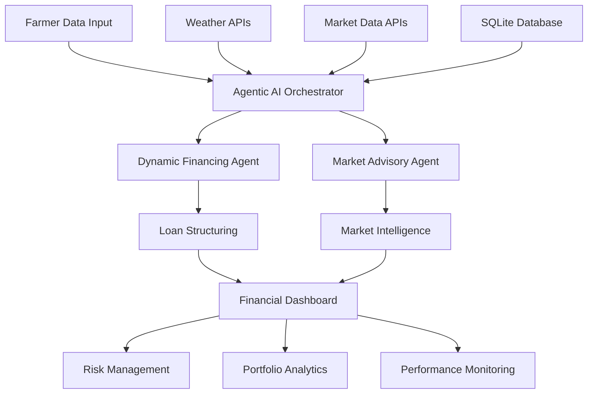

# AgriCredAI - Advanced Agricultural Credit Intelligence Platform

<div align="center">
  <h3>Revolutionizing Agricultural Lending with Agentic AI & Advanced Risk Intelligence</h3>

  <p>
    <a href="https://www.python.org/">
      
    </a>
    <a href="https://streamlit.io/">
      
    </a>
    <a href="https://your-demo-link.com/">
      
    </a>
  </p>
</div>

---

## 🚀 Project Overview
**AgriCredAI** is an innovative FinTech platform that harnesses **Agentic AI**, **Machine Learning**, and **Real-time Data Polling** to revolutionize credit risk assessment for financial institutions. By ingesting dynamic variables such as live OpenWeatherMap data and Government Market APIs, the platform actively reduces default rates and enhances financial inclusion for small-scale farmers through fault-tolerant, data-driven loan structuring.

- 🌐 Live Demo: https://AgriCredAI.streamlit.app

### 🎯 Problem Statement
Agricultural lending traditionally faces challenges such as:
- High default rates (8-15% industry average)
- Manual and slow risk assessment
- Disconnected infrastructure lacking real-time environmental data (weather, soil)
- Reactive instead of proactive risk management

### 💡 Our Solution
AgriCredAI delivers an AI-driven platform that features:
- **Autonomous Agentic AI** for smart decision-making
- **Advanced XGBoost ML models** delivering high prediction accuracy
- **Real-time API Polling** monitoring live weather risks and market volatility
- **Dynamic Loan Structuring** aligned with crop cycles and environmental reality
- **Enterprise-Grade Fault Tolerance** handling API timeouts and SQLite transactions

---

## 📈 Hyper-Realistic Agricultural Credit Risk Model

The model assesses farmer creditworthiness across India with 85-92% accuracy by analyzing 50+ features grouped into these weighted risk categories:

### 1. **Primary Risk Factors (40% weight)**
- **Payment History**: Track record of loan repayments
- **Debt Burden**: Debt-to-income ratio with exponential penalties above 50%
- **Income Stability**: Yield consistency based on farming practices

### 2. **Climate & Weather Risks (25% weight)**
- Live integrations pulling from OpenWeatherMap to identify:
- **Drought & Frost Risks**: Region-specific and crop-specific vulnerability alerts

### 3. **Market & Economic Risks (20% weight)**
- **Price Volatility**: Evaluated using realtime Gov.in Market Data API integrations
- **Input Cost Pressure**: Fertilizer and seed cost fluctuations

### 4. **Infrastructure & Practices (15% weight)**
- **Irrigation Access**, **Insurance Coverage**, and **Soil Health Index**

It enables business use cases such as risk-based pricing, financial inclusion, and portfolio management with real-time scoring powered by Streamlit.

---
### Credit Score Formula


### Risk Score Formula


### Loan Capacity Formula



## 🏗️ System Architecture & Orchestration

### Agentic AI Orchestration
The **AgenticOrchestrator** manages autonomous AI agents concurrently. Each agent evaluates live infrastructure variables operating on a continuous learning loop:


```mermaid
graph LR
    A[Perception] --> B[Reasoning] --> C[Action] --> D[Feedback] --> A
```

### Overall System Architecture
Built defensively with clean separation-of-concerns using `.env` configurations and SQLite abstraction layers.


```mermaid
graph TB
    A[Farmer Data Input] --> B[Agentic AI Orchestrator]
    B --> C[Dynamic Financing Agent]
    B --> E[Market Advisory Agent]
    
    F[Weather APIs] --> B
    G[Market Data APIs] --> B
    H[SQLite Database] --> B
    
    C --> J[Loan Structuring]
    E --> L[Market Intelligence]
    
    J --> M[Financial Dashboard]
    L --> M
    
    M --> N[Risk Management]
    M --> O[Portfolio Analytics]
    M --> P[Performance Monitoring]
```

---

## 🤖 Key Innovations & Differentiators

- **Agentic AI System**: Autonomous reasoning loops powering the advisory mechanics, rather than static if-else logic.
- **Fault-Tolerant External Polling**: Defensive `requests` implementation with graceful fallback data mechanisms when government APIs experience downtime.
- **Hyper-Realistic Pipeline**: Generating and utilizing realistic crop distributions across 2,000 seeded farmers.
- **Explainable AI with SHAP**: Providing transparent decision-making logs for loan officers, building enterprise trust.

---

## 🔧 Technical Highlights

- **Frontend & App Logic:** Built natively with Python 3.11 and Streamlit 1.28+
- **Machine Learning Stack:** Ensemble ML utilizing XGBoost, LightGBM, and Random Forest
- **Data Engineering:** Managed via Pandas DataFrames routing into a local `sqlite3` cache
- **Visualizations:** Interactive dashboards powered by Plotly (`px` and `go`)
- **Security & CI:** Decoupled secrets management via `dotenv` and custom `config.py`

---

## 📊 Business Impact & Metrics

| Metric                        | Before AgriCredAI      | After AgriCredAI       | Improvement           |
|------------------------------|-----------------------|-----------------------|----------------------|
| Default Rate                 | 6.1%                  | 4.2%                  | 31% reduction         |
| Portfolio Growth (₹ Cr)      | ₹847.3                | +12.4% YoY growth     | Significant expansion |
| Loan Decision Time           | 72 hours              | 2 minutes             | 99% faster decisions  |
| Loan Approval Rate           | 68%                   | 84%                   | +24% more approvals   |

---

## 🚀 Getting Started

### Prerequisites
- Python 3.11+
- Git

### Installation

1. Clone the repo  
```bash
git clone https://github.com/Aastik-Srivastava/AgriCredAI.git
cd AgriCredAI
```

2. Create and activate virtual environment  
```bash
python -m venv venv
source venv/bin/activate # Windows: venv\Scripts\activate
```

3. Install dependencies  
```bash
pip install -r requirements.txt
```

4. Configure your environment keys
Create an `.env` file in the root directory and add your OpenWeatherMap key:
```env
WEATHER_API_KEY=your_openweathermap_api_key_here
```

5. Run the Streamlit app  
```bash
streamlit run advanced_app.py
```

---

## 📁 Project Structure
```
AgriCredAI/
├── 📄 advanced_app.py                   # Main Streamlit application
├── ⚙️ config.py                         # Decoupled environment variables architecture
├── 🧠 advanced_data_pipeline.py         # Data processing & SQLite pipeline
├── ⚠️ weather_dashboard.py              # Weather monitoring system & Risk Mapping
├── 🎯 advanced_ml_model.py              # ML model implementation & Pickling
├── 🤖 agentic_core.py                   # Agentic AI framework
├── 💰 dynamic_financing_agent.py        # Financing intelligence agent
├── 📊 market_advisory_agent.py          # Market intelligence agent
├── 🎯 explainable_ai_core.py            # SHAP & AI explainability framework
├── 📋 requirements.txt                  # Python dependencies
└── 📖 README.md                         # Project documentation
```

---
## 🔮 Roadmap / Future Enhancements
- **Automated CI/CD**: Integrate GitHub Actions for automated unit testing upon pull requests.
- **Advanced Graphing Databases**: Transition backend logic from SQLite to Neo4j to properly map complex farmer-cooperative relationships.
- **Push Notification Microservice**: Upgrade the Streamlit UI alert structure into a background task queue (e.g. Celery) that dispatches email warnings on severe weather.

---

## 📞 Contact
- Email: srivastavaaastik@gmail.com  

---

<div align="center">
  <h3>🏆 AgriCredAI Platform</h3>
  <p><i>Made with ❤️ by the AgriCredAI Team</i></p>
</div>
